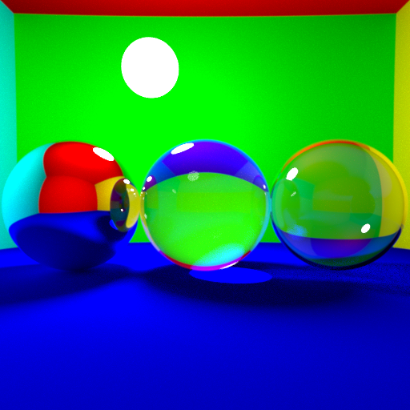
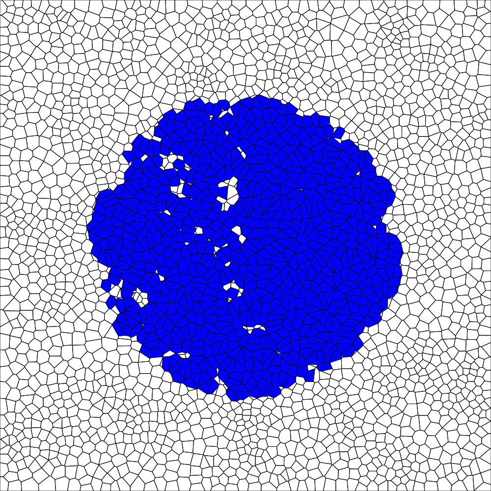

# Computer Graphics Projects
A repository containing my Computer Graphics Projects. 

- The folder RayTracer_Assignement1 contains the implementation and report of a Ray Tracer with several features done under the context of the CSE306 course at École Polytechnique. Grade 20/20  

- The folder fluid_simulation contains the implementation of a Fluid simulator as well as a report and some animations of the fluid. This project was also done under the context of the CSE306 course at École Polytechnique. Grade 20/20.  

